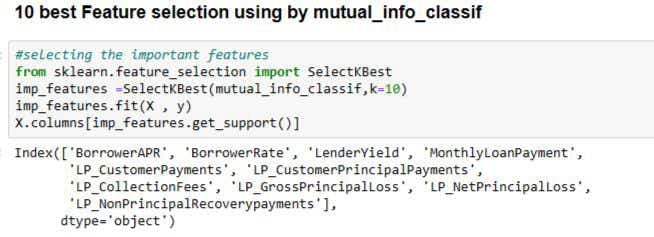

# Predictive Analysis Using Social Profile on Online P2P Lending Market

## 🚀 Project Overview

This project analyzes and predicts loan performance in peer-to-peer lending markets using both financial and social profile data. The analysis leverages machine learning techniques to provide insights into loan approval and risk assessment.

## 📊 Introduction

Prosper, a global peer-to-peer lending platform, has funded over $8 billion in loans. It enables individuals to invest in each other in a way that is both financially and socially rewarding. Borrowers can list loan requests ranging from $2,000 to $35,000, and individual investors can invest as little as $25 in each loan listing they select.

### Key Findings
- Analysis of 9,479 completed P2P transactions from 2007
- Social indicators improve P2P performance prediction
- Financial strength remains the primary predictor of loan success
- Integration of social factors enhances traditional financial models

## 🛠️ Technical Stack

### Core Dependencies
- Python 3.x
- scikit-learn
- numpy
- pandas
- matplotlib
- seaborn
- Flask
- joblib

### Additional Libraries
- imblearn (for handling imbalanced data)
- StandardScaler (for feature scaling)
- warnings (for handling warnings)

## 📋 Project Pipeline

1. **Data Loading & Preprocessing**
   - Data cleaning
   - Handling missing values
   - Feature engineering

2. **Exploratory Data Analysis**
   - Univariate analysis
   - Bivariate analysis
   - Multivariate analysis
   - Statistical insights

3. **Model Development**
   - Feature selection
   - Model training
   - Performance evaluation
   - Model optimization

4. **Web Application**
   - Flask backend
   - Interactive frontend
   - Real-time predictions

## 👥 Team Members

- Kritagya Upadhayay (Member)
- Satyam Sharma (Member)

## 📈 Key Features

- **Data Analysis**: Comprehensive analysis of loan performance factors
- **Predictive Modeling**: Machine learning models for loan outcome prediction
- **Web Interface**: User-friendly interface for loan predictions
- **Documentation**: Detailed documentation of methodology and findings

## 🔍 Methodology

1. **Data Collection & Cleaning**
   - Comprehensive data preprocessing
   - Handling missing values
   - Feature engineering

2. **Exploratory Analysis**
   - Statistical analysis
   - Visualization of key patterns
   - Correlation studies

3. **Model Development**
   - Multiple model testing
   - Performance comparison
   - Model optimization

4. **Deployment**
   - Web application development
   - API integration
   - User interface design

## 📊 Results

The project successfully demonstrates:
- Improved prediction accuracy using social indicators
- Integration of financial and social factors
- Practical application in P2P lending

## 🚀 Future Scope

- Integration of additional social indicators
- Real-time data processing
- Enhanced model accuracy
- Mobile application development

## 📝 License

This project is licensed under the MIT License - see the LICENSE file for details.

## 🤝 Contributing

Contributions are welcome! Please feel free to submit a Pull Request.

# Project Overview 

# Predictive-Analysis-Using-Social-Profile-on-Online-P2P-Lending-Market by Team-A

## Introduction:

Prosper, a global peer-to-peer lending platform, has funded over \$8 billion in loans. It allows individuals to invest in each other in a way that is both financially and socially rewarding. Borrowers can list loan requests ranging from \$2,000 to \$35,000 on Prosper, and individual investors can invest as little as \$25 in each loan listing they select. Prosper handles loan servicing on behalf of the matched borrowers and investors.

In the following sections, we will clean up the data and perform exploratory data analysis on the loan data using univariate, bivariate, and multivariate graphs and summaries. The analysis section will highlight the most intriguing observations from the plots. In the final plots and summary section, we will identify the top three charts and provide final reflections on the dataset.

In an experiment, we examined the borrowers, loans, and groups that influence performance predictability in the online P2P lending industry. We conceptualized financial and social strength and forecasted the borrower's rate and whether the loan would be paid on time. Using a database of 9,479 completed P2P transactions, we conducted an empirical investigation. The transactions from the calendar year 2007 supported the suggested conceptual model. The findings revealed that P2P performance prediction can be improved by using social indicators. Although social factors influence borrowing rates, their effects are quite minimal compared to financial strength and status. This study underscores the importance of financial documents in predicting P2P performance.

Sure, here's the updated dependencies section with the additional libraries:

## Dependencies

To access the files in this repository, you will need:

- [Python 3](https://www.python.org/downloads/)
- [scikit-learn](https://scikit-learn.org/stable/install.html)
- [numpy](https://numpy.org/install/)
- [pandas](https://pandas.pydata.org/pandas-docs/stable/getting_started/install.html)
- [StandardScaler](https://scikit-learn.org/stable/modules/generated/sklearn.preprocessing.StandardScaler.html) (part of scikit-learn)
- [matplotlib](https://matplotlib.org/stable/users/installing.html)
- [imblearn](https://imbalanced-learn.org/stable/install.html)
- [joblib](https://joblib.readthedocs.io/en/latest/installing.html)
- [pickle](https://docs.python.org/3/library/pickle.html) (part of Python's standard library)
- [seaborn](https://seaborn.pydata.org/installing.html)
- [warnings](https://docs.python.org/3/library/warnings.html) (part of Python's standard library)


## Steps Involved

| No. | Task |
| --- | --- |
| 1 | [Data Loading](#data-loading) |
| 2 | [Data Preprocessing](#data-preprocessing) |
| 3 | [Exploratory Data Analysis (EDA)](#eda) |
| 4 | [Feature Engineering](#feature-engineering) |
| 5 | [Principal Component Analysis (PCA)](#pca) |
| 6 | [Model Building](#model-building) |
| 7 | [Model Pipelining](#model-pipelining) |
| 8 | [Flask Web Application](#flask-web-application) |
| 9 | [Model Deployment](#model-deployment) |


# Data Loading :

Data loading is the process of copying and loading data or data sets from a source file, folder, or application to a database or similar application³. It's an integral part of the ETL (Extract, Transform, Load) process, which is commonly used in data warehousing¹².

```
#lOADING OF THE DATASET
df=pd.read_csv("prosperLoanData.csv")
df.head()
```


# Data Preprocessing:

**Checking Null Values**

```
df.isna().sum()
#checking of the null values 
```


**Checking the unique values**

```
# Returns the number of unique in the dataset
loan_df.nunique()
```


**Checking the data type of every column**

```
#checking the dtypes of every column
loan_df.dtypes
```


**Handling Missing Values** Create individual dataframes for numerical and categorical feilds. Apply Mean and Median Imputaion Technique as per the rquirement in the missing feilds , For categorical variables we applied Mode.

```
categorical = df.select_dtypes("object")
continuous = df.select_dtypes("number")

categorical=categorical.fillna(categorical.mode().iloc[0])
continuous=continuous.fillna(continuous.median().iloc[0])
```

* As the data gets cleaned then we are going to convert the dataframe into the csv file so that the cleaned data can be processed for further operations.

```
loan_df.to_csv('preprocessed_data2.csv', index=False)
```


# Exploratory Data Analysis (EDA):

## Overview

Exploratory Data Analysis (EDA) is a critical step in data analysis that involves summarizing and visualizing the main characteristics of a dataset. The primary goal is to gain insights into the data, understand its underlying patterns, identify potential outliers, and guide the selection of appropriate statistical techniques. EDA often includes the use of descriptive statistics, data visualization, and various graphical representations to explore relationships and trends within the data.

## Key Steps in EDA

1. **Data Summary:** Begin by examining basic statistics, such as mean, median, standard deviation, and quartiles, to get an overall sense of the data's central tendency and spread.

2. **Univariate Analysis:** Analyze individual variables independently. Use histograms, box plots, or kernel density plots to visualize the distribution of each variable.

3. **Bivariate Analysis:** Explore relationships between pairs of variables. Scatter plots, correlation matrices, and heatmaps are useful for identifying patterns and dependencies.

4. **Multivariate Analysis:** Multivariate analysis involves the simultaneous observation and analysis of more than one statistical outcome variable. It aims to understand how different variables in a dataset relate to one another and how they collectively influence the outcomes.

5. **Outlier Detection:** Identify and handle outliers that may significantly impact the analysis. Box plots and scatter plots are common tools for outlier detection.

6. **Data Visualization:** Utilize various graphical representations, such as bar charts, pie charts, and line graphs, to communicate key findings effectively.

## Example Code

```python
# Sample Python code for basic EDA using pandas and matplotlib
import pandas as pd
import matplotlib.pyplot as plt

# Load dataset (replace 'your_dataset.csv' with the actual filename)
df = pd.read_csv('your_dataset.csv')

# Display basic statistics
print(df.describe())

# Create a histogram for a specific variable (replace 'column_name' with the actual column name)
plt.hist(df['column_name'], bins=30, color='blue', alpha=0.7)
plt.title('Distribution of column_name')
plt.xlabel('Values')
plt.ylabel('Frequency')
plt.show()
```

## Univariate Analysis

Univariate analysis is the analysis of a single variable at a time. It is a fundamental step in the exploratory data analysis process and provides insights into the distribution, central tendency, and variability of individual variables. Univariate analysis focuses on exploring and summarizing the characteristics of a single variable. It helps in understanding the distribution of values, detecting outliers, and obtaining key statistics.

**Question 1 What is the relation of BorrowerAPR ?**

```
# Plotting displot.
sns.displot(data=df,x='BorrowerAPR',rug=True,rug_kws={'c':'purple'})
plt.title('Distribution of borrower APR');
```


Count of borrower APR between 0.34 and 0.36 is maximum. This could mean that average percentage rate for many loans is approximately between 0.3 and 0.4 which is very high. And minimum APR is approx. 0.02. There are some high bins between 0.16 and 0.2. There is a fall in count of APR values after 0.2 but again APR increases from 0.26 to 0.3. Than data fall and again their is huge rise in the count of APR.

**Question 2  What is the relation of Borrower Rate?**

```
bins = np.arange(0,df['BorrowerRate'].max()+0.01,0.01) 
plt.hist(x='BorrowerRate',data=df,bins=bins)
plt.title('Distribution of borrower Rate')
plt.xlabel('borrower rate')
plt.ylabel('count');
```


It is a bimodal distribution with one peak lie between 0.15 and 0.17 and another peak lies between 0.30 and 0.33. It is right skewed distribution. After 0.16 rate their is decrease in count but between 0.32 and 0.34 their is sudden increase in the count of borrower rate.

**Question 3 What is the realtion of LoanOriginalamount?**

```
base_color2 = sns.color_palette()[1]
plt.figure(figsize=(10,8))
sns.countplot(y='ListingLabels',data=df,order=df['ListingLabels'].value_counts().index,color=base_color2)
plt.title('Displaying counts of listing labels in our data');
```


**Discuss the distribution(s) of your variable(s) of interest. Were there any unusual points?**

In debt to income variable, their were some points which were greater than 1. So, I considered them as outliers because when I did some research about minimum and maximum DTI, I found that maximum DTI can reach upto 50% or 0.5. So, it is very unlikely that DTI would be greater than 1.

I performed some transformation on Debt to income ratio variable, Loan original amount variable, and borrower rate. I did log transformation on stated monthly income. Data was highly right skewed before transformation but after doing transformation I observed that most of the data points are between 2k to 10k approx..

**Of the features I investigated, were there any unusual distributions?**

I did some transformation on Debt to income ratio variable, Loan original amount variable, and borrower rate. These transformations include:

1- Changing X-ticks to view more exact point of interest.
2- Changing bins size to reduce noise in the graph and view data more precisely.
3- Using log xscale to make interpretations from the graph easy.*

## Bivariate Analysis

Bivariate analysis involves the simultaneous analysis of two variables to understand the relationships and interactions between them. This type of analysis is crucial for exploring connections, dependencies, and patterns in the data. Bivariate analysis explores the relationship between two variables, helping to understand how changes in one variable correlate with changes in another. This analysis is fundamental for identifying patterns, dependencies, and potential cause-and-effect relationships.

**Heat map to show corelation of numerical column**

```
# Plotting a heat map to show the correlation of each numerical variable.
 plt.figure(figsize=(15,15))
 sns.heatmap(data=loan_df[numeric_var].corr(),annot=True,fmt='.3f')
 plt.title('Correlation of numerical variable using heat map');
```

```
 # plot matrix: sample 500 loans so that plots are clearer.
 samples = np.random.choice(loan_df.shape[0], 10000, replace = False)
 loan_samp = loan_df.loc[samples,:]
 pg = sns.PairGrid(data = loan_samp, vars = numeric_var,height=2)
 pg = pg.map_diag(plt.hist, bins = 20)
 pg.map_offdiag(plt.scatter,alpha=1/6)
 pg.fig.suptitle('Displaying how numerical features are related with each other using pairgrid',y=1.02);
```

**From the above two graphs, I have concluded several points:**

1- Borrower APR is highly correlated with Borrower Rate.
2- If borrower rate increases borrower APR will also increase and vice-versa.
3- There is a moderate correlation between investors and Loan original amount.
4- It is strange that debt to income ratio is very low correlated with every other variable. It could be due to not including large number of features from main dataframe 'df'. But I will try to explore this feature with categorical variables. Also, if we look at the DTI (debt to income ratio) graph (pairplot) and compare it with the graphs of borrower APR and borrower Rate, we can observe that their is some correlation between these variables.
5- Their seem to be some outliers present in credit score range upper and credit score range lower variables. I will remove them and than again plot the pairgrid to see the correlation.
6- Their is moderate negative correlation between loan original amount and Borrower APR, Borrower Rate variables.

**Question 1 Relation between 'Borrower APR' and 'credit score class' variable ?**

```base_c=sns.color_palette()[0]
sns.violinplot(data=loan_df, x='credit_score_class', y='BorrowerAPR', color=base_c, inner=None)
plt.xticks(rotation=15)
plt.title(' plot showing relation between credit score class and APR');
```


**Question 2 Relation between 'Borrower APR' and 'loan status' variable.?**

```
# Plotting histogram with seaborn's facetgrid function.
bins = np.arange(0.01,0.4+0.01,0.01)
f=sns.FacetGrid(data=loan_df,col='LoanStatus',col_wrap=4,sharey=False,sharex=False,height=4.5)
f.map(plt.hist,'BorrowerAPR',bins=bins)
f.fig.suptitle('Borrower APR vs Loan status',y=1.02);
```


**Question 3 Relation between 'Borrower APR' and 'Borrower Rate' variable.?**

```
for lab in ['BorrowerAPR','BorrowerRate']:
    bins = np.arange(0,loan_df[lab].max()+0.04,0.04)
    bins = [round(x,2) for x in bins]
    loan_df[f'{lab} cat'] = pd.cut(x=loan_df[lab],bins=bins,labels=bins[1:],include_lowest=False)
```

```
plt.figure(figsize=(18, 7))
sns.heatmap(loan_df.groupby(['BorrowerAPR cat','BorrowerRate cat']).size().unstack('BorrowerRate cat').replace({0:np.nan}),annot=True,
           fmt='.0f',cmap='viridis_r',vmin=0,cbar_kws={'label':'Count of borrower Rate with respect to borrower APR'})
plt.title('Borrower Rate affect on Borrower APR',fontdict={'size':20})
plt.xlabel('Borrower Rate',fontdict={'size':15})
plt.ylabel('Borrower APR',fontdict={'size':15})
plt.yticks(rotation=0)
plt.show();
```


***I have made several observations from above three plots:***

Maximum number of borrowers took loan for 36 months. Also, count of borrower APR is maximum at 36 months because of first observation. Using box plot I observed that at 36 month distribution of Borrower APR is slightly left skewed. Also, median falls at 0.2 approx which is close to first quartile. This could mean that maximum borrowers who took loan for 36 months had APR between 0.16 and 0.2 approx. which is quite good compare to other borrowers APR which falls between 0.21 and 0.3 approx. Minimum APR is 0.01 approx. at 36 month term which is a good sign. Maximum APR is above 0.4 at 36 month term which is considered as bad news.

## Multivariate Analysis

Multivariate analysis refers to statistical techniques that simultaneously analyze and interpret the relationships among multiple variables in a dataset. Unlike univariate analysis (which focuses on a single variable) and bivariate analysis (which explores relationships between two variables), multivariate analysis considers more than two variables at the same time. The goal is to understand the complex interactions and dependencies within the dataset.

**Question 1 Relation between 'Loan Status' with 'Borrower APR' and 'Borrower Rate' ?**

```
 # Plotting heatmap using seaborn's facetgrid.
bins_x = np.arange(0,loan_df['BorrowerAPR'].max()+0.01,0.02)
bins_y = np.arange(0,loan_df['BorrowerRate'].max()+0.01,0.03)
g = sns.FacetGrid(data = loan_df, col = 'LoanStatus', col_wrap = 4, height = 4.7)
g.map(plt.hist2d, 'BorrowerAPR', 'BorrowerRate',bins=[bins_x,bins_y], cmap = 'viridis_r', cmin = 0.5)
g.set_xlabels('APR')
g.set_ylabels('Rate')
g.fig.suptitle('Loan status by borrower rate and APR',y=1.01)

plt.show()
```


From above 2d graph I have made several observations:
1- Out of all loan status, 'completed' and 'current' status are the only ones with maximum count of APR and rate less than or equal to 0.2.
2- Rest of the loan status have a 'cloud' of points above 0.2 for both APR and Rate except 'cancelled' status as it has only one record in our data.
3- If borrower APR and rate are high than loan status is more likely to be anything except 'current' and 'completed'

**Question 2 Relation between 'loan status' , 'Loan Term',loan amount' and 'debt to income ratio'?**

```
g = sns.FacetGrid(data = loan_df, col = 'LoanStatus', col_wrap = 4, height = 4,sharex=False,sharey=False)
g.map(plt.hist2d, 'LoanOriginalAmount', 'DebtToIncomeRatio',cmap = 'inferno_r',cmin=0.5)
g.set_xlabels('loa')
g.set_ylabels('dti')
g.fig.suptitle('Loan status by DTI and loan amount',y=1.01)
plt.colorbar()
plt.show()
```


# Feature Engineering:

## Label Encoding

Label Encoding is a technique to converting categorical data into a numerical format, such as label encoding the 'CreditGrade' feature, enables algorithms to understand and utilize categorical information effectively in predictive modeling.

```
from sklearn import preprocessing
 
#label_encoder object knows how to understand word labels.

label_encoder = preprocessing.LabelEncoder()
  
#Encode labels in column 'species'.

loan_df['CreditGrade']= label_encoder.fit_transform(loan_df['CreditGrade'])
```


## Data Splitting

Splitting the dataset into training and testing sets allows for model evaluation on unseen data, gauging the model's ability to generalize to new observations.

```

# Splitting data into Training and Testing data

X= loan_df.drop(columns="LoanStatus", axis=1)

y= loan_df["LoanStatus"]
```


## Feature Importance Assessment

### Using Mutual info classifier

Using the technique of mutual information, the relevance and influence of different features on predicting loan outcomes are evaluated. This step helps identify and prioritize the most impactful features for model training.

```
from sklearn.feature_selection import mutual_info_classif

# determine the mutual information

mutual_info = mutual_info_classif(X, y)

mutual_info

mutual_info = pd.Series(mutual_info)
mutual_info.index = X.columns
mutual_info.sort_values(ascending=False)

```


### Selecting the best 10 important features using mutual_info_classifier

Selecting the top 10 most important features from dataset using Mutual information classifier(MIC). MIC is used to measure the dependency between variablesand identify the most relevent features for predictive modelling.

```
#selecting the important features

from sklearn.feature_selection import SelectKBest
imp_features =SelectKBest(mutual_info_classif,k=10)
imp_features.fit(X , y)
X.columns[imp_features.get_support()]
```



## Data Imbalance

Handling imbalanced data through SMOTE strategy ensures the model does not lean towards the majority class, improving its ability to make accurate predictions for all classes.

```
from imblearn.over_sampling import SMOTE
smot = SMOTE(sampling_strategy='minority')

X, y = smot.fit_resample(X, y) 
y.value_counts()
```


# Principal Component Analysis (PCA):

Principal Component Analysis (PCA) was applied to reduce the dimensionality of the dataset. PCA is a technique commonly used for feature extraction and dimensionality reduction.

## Explaination

The process begins by initializing the PCA object from the scikit-learn library using PCA().

**Transformation of Data:**
The fit_transform method is then applied to the dataset (X). This method computes the principal components and transforms the original data into the principal component space.

**Principal Components DataFrame:**
The resulting principal components are stored in a DataFrame (X_pca), with each column representing a different principal component.

**Loadings DataFrame:**
The loadings of each principal component are extracted and organized in a DataFrame (data_load). These loadings indicate the contribution of each original feature to the corresponding principal component.

## Interpretation

This application of PCA is valuable for several reasons:

* **Dimensionality Reduction:** PCA helps in reducing the number of features in the dataset while retaining the most important information.

* **Identifying Patterns:** The loadings provide insights into which features contribute significantly to each principal component, aiding in the interpretation of underlying patterns in the data.

```
from sklearn.decomposition import PCA

pca = PCA()
X_pca = pca.fit_transform(X)
component_names = [f"PC{i+1}" for i in range(X_pca.shape[1])]
X_pca = pd.DataFrame(X_pca, columns=component_names)
X_pca.head()

data_load = pd.DataFrame(
    pca.components_.T,        # Transpose the matrix of loadings
    columns=component_names,  # Principal components as columns
    index=X.columns           # Original features as rows
)

data_load
```


#  Model Building:

## Metrics considered for model evaluation

**Accuracy, Precision, Recall and F1 Score**
- Acuracy: What proportion of actual positives and negatives are truly poaitive ? 
- Precision: What proportion of predicted positives are truly positive ?
- Recall: What proportion of actual positive is correctly classified ?
- F1 Score : Harmonic mean

## Logistic Regression
- Logistic Regression helps find how probabilities are changed with actions.
- It not only provides a measure of how appropriate a predictor(coefficient size) is, but also its direction of association (positive or negative).
- The function is defined as P(y) = 1 / 1+e^-(A+Bx) 
- Logistic regression involves finding the best fit S-curve where A is the intercept and B is the regression coefficient. The output of logistic regression is a probability score.

Now, Applying the ***logistic Regression algorithm*** to train the dataset of the Prosper P2P lending market.

~~~
from sKlearn.linear_model import LogisticeRegression
logmodel = LogisticRegression()

# training the model
logmodel.fit(X_train,y_train)
predictions = logmodel.predict(X_test)

## Evaluating the model

from sKlearn.metrics import Classification_report
print(classification_report(y_test,predictions))
accuracy = logmodel.score(X_test, y_test)
print(f"Accuracy: {accuracy}")
~~~


## Naive Bayes

The term "Naïve Bayesian classifiers" refers to a set of classification algorithms based on Bayes' Theorem. It is a family of algorithms that all share a common principle, namely that every pair of features being classified is independent of each other. Bayes Theorem provides a principled way for calculating the conditional probability.

The simple form of the calculation for Bayes Theorem is as follows:

P(A|B) = P(B|A) * P(A) / P(B)

We can frame classification as a conditional classification problem with Bayes Theorem as follows:

P(yi | x1, x2, …, xn) = P(x1, x2, …, xn | yi) * P(yi) / P(x1, x2, …, xn)

The prior P(yi) is easy to estimate from a dataset, but the conditional probability of the observation based on the class P(x1, x2, …, xn | yi) is not feasible unless the number of examples is extraordinarily large, e.g. large enough to effectively estimate the probability distribution for all different possible combinations of values.

We now went into greater detail about the introduction and how the simple form of the Bayes Theorem calculation is performed. Let's see what happens when we apply the naive bayes algorithm to our own dataset.

### 1. Gaussian Naive Bayes model 
~~~
from sklearn.naive_bayes import GaussianNB
from sklearn.metrics import accuracy_score


# Instantiate the Gaussian Naive Bayes model
gnb = GaussianNB()

# Train the model on the training data
gnb.fit(X_train, y_train)

# Generate predictions on the test set
Y_pred = gnb.predict(X_test)

# Evaluating the model
from sklearn.metrics import classification_report, confusion_matrix
print(classification_report(y_test,Y_pred))

accuracy = accuracy_score(y_test, Y_pred)
print("Gaussian Naive Bayes model accuracy (in %):", accuracy * 100)
~~~


### 2. Bernoulli Naive Bayes model
~~~
from sklearn.naive_bayes import MultinomialNB 
from sklearn.naive_bayes import Ber

bnb=BernoulliNB()

# training the model
bnb.fit(X_train,y_train)
Y_pred=bnb.predict(X_test)

# Evaluating the model
from sklearn.metrics import classification_report, confusion_matrix
print(classification_report(y_test,Y_pred))
from sklearn import metrics
print("Bernoulli Naive Bayes model accuracy(in %):", metrics.accuracy_score(y_test, Y_pred)*100)
~~~


Then we went ahead and applied below mentioned regression models to predict borrower rate, for that we have created three target variables EMI, ROI, ELA {eligible loan amount}

## Linear Regression

- Basic Concept: Linear regression is a statistical method used to model the relationship 
 between a dependent variable and one or more independent variables.

- Objective: It aims to find the best-fitting linear equation that predicts the dependent variable based on the independent variable(s).
  
- Equation: The simple linear regression equation for one independent variable is Y = a + bX, 
 where Y is the dependent variable, X is the independent variable, a is the intercept, and b 
 is the slope of the line.
- Assumptions: Assumes a linear relationship between variables, normality of residuals, 
 homoscedasticity (constant variance), independence of errors, etc.
- Evaluation: Common evaluation metrics include R-squared, Mean Squared Error (MSE), Root Mean 
 Squared Error (RMSE).

now, Applying the linear Regression algorithm to train the dataset of the Prosper P2P lending market.
~~~
from sklearn.linear_model import LinearRegression
classifier = LinearRegression()

## Training the dataset
classifier.fit(X_train,Y_train)
Y_pred=classifier.predict(X_test)

## Evaluating the matrix
accuracy = classifier.score(X_test, Y_test)
print(f"Accuracy: {accuracy}")

from sklearn import metrics
print('MSE:', metrics.mean_squared_error(Y_test, Y_pred))
print('MAE:', metrics.mean_absolute_error(Y_test, Y_pred))
print('RMSE:', np.sqrt(metrics.mean_squared_error(Y_test, Y_pred)))
~~~


## Ridge Regression

- Purpose: Ridge regression is a regularization technique used to mitigate multicollinearity 
 (high correlation between predictors) and overfitting in regression models.
-Addition to Linear Regression: It's an extension of linear regression that adds a penalty 
 term (L2 regularization) to the traditional least squares method.
-Penalty Term: The penalty term in ridge regression is the sum of squared coefficients 
 multiplied by a hyperparameter λ (lambda).
-Advantages: Helps to handle multicollinearity by shrinking the coefficients towards zero 
 without removing predictors entirely.

let's implement this model on our dataset

~~~
from sklearn.linear_model import Ridge
ridge = Ridge(alpha=1.0)

#Training the dataset
ridge.fit(X_train,Y_train)
Y_pred=ridge.predict(X_test)

#Evaluating the model
from sklearn.metrics import r2_score
r2= r2_score(Y_test,Y_pred)
print("R2 score:", r2)
print('MSE:', metrics.mean_squared_error(Y_test, Y_pred))
print('MAE:', metrics.mean_absolute_error(Y_test, Y_pred))
print('RMSE:', np.sqrt(metrics.mean_squared_error(Y_test, Y_pred)))
~~~


# Model Pipelining:

## Linear Regression Pipeline
Constructed a pipeline incorporating data scaling, PCA (Principal Component Analysis), and Linear Regression.
below is the code for the same.

~~~

from sklearn.pipeline import Pipeline
from sklearn.model_selection import train_test_split
from sklearn.decomposition import PCA
from sklearn.preprocessing import StandardScaler
from sklearn.metrics import accuracy_score

from sklearn import set_config
pca = PCA()
scaler = StandardScaler()
LR_model = LinearRegression()

X_train, X_test, Y_train, Y_test = train_test_split(X, y, test_size=0.30, random_state=100)

linear_regression_pipeline=Pipeline([
    ("sclaer",scaler),
    ("pca",pca),
    ("LR_model",LR_model)
])
linear_regression_pipeline.fit(X_train,Y_train)

Y_pred=linear_regression_pipeline.predict(X_test)

from sklearn.metrics import r2_score
r2= r2_score(Y_test,Y_pred)
print("R2 score:", r2)

print('MSE:', metrics.mean_squared_error(Y_test, Y_pred))
print('MAE:', metrics.mean_absolute_error(Y_test, Y_pred))
print('RMSE:', np.sqrt(metrics.mean_squared_error(Y_test, Y_pred)))
~~~


## Ridge Regression Pipeline
Built a similar pipeline integrating data scaling, PCA, and Ridge Regression.

## Multi-Output Regression Pipeline
Developed a pipeline that stacked Linear Regression and Ridge Regression within a Gradient Boosting Regressor for multi-output predictions.

## Final Models and Serialization
Classification Pipeline
Created a pipeline combining Bernoulli Naive Bayes and Logistic Regression within a Stacking Classifier for loan category classification.

### Serialization
Serialized the final models using Pickle for future use.

#### code creating a pickle file of final classification model

~~~
import pickle as pkl
pkl.dump(classification_models,open('cls_model_final.pkl','wb'))
~~~

# Flask App:

Flask is a web framework for Python that allows you to build web applications quickly and with minimal code. It's a micro-framework that is lightweight, modular, and easy to use. Integrating HTML and CSS forms with a Flask app involves creating HTML templates, defining routes in the Flask application, and handling form submissions.

Let's create a simple Flask app with an HTML form. Below is a README markdown code template that includes explanations and sample code:

## Flask App with HTML/CSS Form Integration

### Overview

This project demonstrates the integration of an HTML form with a Flask web application. Flask is a Python web framework, and it's used here to handle form submissions and render dynamic web pages.

### Prerequisites

- Python installed
- Flask installed (you can install it using `pip install Flask`)

### Flak Template code

```

### Steps to Run the Application
1. Install Flask: `pip install Flask`
2. Clone or download this repository.
3. Navigate to the project directory in the terminal.
4. Run the Flask app: `python app/app.py`
5. Open your web browser and go to `http://localhost:5000`.

## Flask App Code (app.py)

from flask import Flask, render_template, request

app = Flask(__name__)

@app.route('/', methods=['GET', 'POST'])
def index():
    if request.method == 'POST':
        # Handle form submission
        data_from_form = request.form['input_field']
        # Process the data or perform any necessary actions
        return render_template('index.html', form_data=data_from_form)
    else:
        return render_template('index.html', form_data=None)

if __name__ == '__main__':
    app.run(debug=True)

```

# Model Deployment:

## Table of Contents
1. [Introduction](#introduction)
2. [EC2 Instance Setup](#ec2-instance-setup)
   - [Launch an EC2 instance on AWS](#launch-an-ec2-instance-on-aws)
   - [Connect to the instance using SSH](#connect-to-the-instance-using-ssh)
   - [Update and install necessary packages](#update-and-install-necessary-packages)
3. [Project Directory Structure](#project-directory-structure)
4. [Python Environment Setup](#python-environment-setup)
5. [Web Application](#web-application)
6. [Running the Application](#running-the-application)

## Introduction
In this deployment phase, we use the intelligence gathered mutually by borrower-targeted attributes of borrowers, loan features and more subtle effects related to groups of borrows. The general purpose is to provide market participants in the P2P lending industry with a practical and efficient instrument. With this tool, they are equipped with the knowledge to make informed lending choices and reduce risks; thus encouraging transparency and reliability of loans within P2P online platforms.

This model helps to close the gap between traditional financial ratios and rising social proxies, helping advance predictive analytics in the digital lending community. This is an excellent tool for investors, lenders as well borrowers and it fits right into the bigger picture of promoting digital lending itself.

## EC2 Instance Setup
### Launch an EC2 instance on AWS
1. Log in to the AWS Management Console.
2. Navigate to EC2 and launch a new instance, selecting a Linux AMI.
3. Configure security groups to allow SSH (port 22) and any other necessary ports for your application.

### Connect to the instance using SSH
To connect to the EC2 instance, execute the following command in your terminal:

```bash
ssh -i /path/to/your/private-key.pem ec2-user@your_ec2_instance_ip
```

### Update and install necessary packages
```bash
sudo yum update
sudo yum install python3
```

## Project Directory Structure
```plaintext
/home/ec2-user/
│
└── P2P Loan/
    ├── myenv/              # Virtual environment
    ├── requirements.txt    # Python dependencies
    ├── templates/          # HTML templates for the web app
    │   └── index.html
    ├── web_app.py          # Python script for the web application
    └── your_model_file.pkl # Trained machine learning model file
```

## Python Environment Setup
1. Navigate to the project directory:

    ```bash
    cd /home/ec2-user/P2P\ Loan/
    ```

2. Create and activate a virtual environment:

    ```bash
    python3 -m venv myenv
    source myenv/bin/activate
    ```

3. Install project dependencies:

    ```bash
    pip3 install -r requirements.txt
    ```

## Web Application
1. Create a templates directory and place the index.html file inside it.

    ```bash
    mkdir templates
    cp /path/to/index.html /home/ec2-user/P2P\ Loan/templates/
    ```

2. Customize the index.html file based on your web application needs.

## Running the Application
Execute the following command to start the web application:

```bash
python3 web_app.py
```

Access the application in your browser at http://54.81.142.120:8000/.


### Team Details:

| Role | Name |
| --- | --- |
| Team Lead | Kritagyay Upadhayay |
| Co Team Lead | Utnoori Sushma |
| Member | Anurag Singh |
| Member | Sakshi Thakare |
| Member | Aditi Deshwal |
| Member | Brempong Appiah Dankwahh |
| Member | Taha Elrefaey |
| Member | Prerna Mishra |